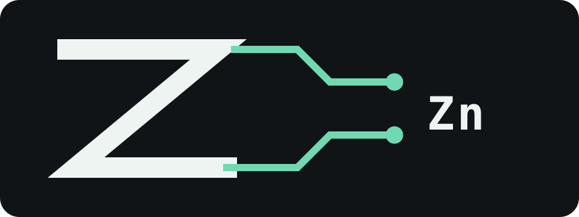

[](https://github.com/darkhorseprojects/zinc/actions/workflows/check.yml)
[](LICENSE)

# Zinc



Zinc is one persistent local Agent, written as five executable Markdown modules:

```text
agent.md          provider request and direct entry
core/run.md       Run lifecycle and five-field API
core/database.md  SQLite history and retrieval
core/env.md       files, HTTP, shell, and profile policy
core/builder.md   anonymous tool execution
```

Circuitry runs the Teal fences on Lua 5.5. Zinc uses operator-installed `lsqlite3`, LuaFileSystem, Lua-cURL, and `dkjson` directly through sealed modules.

## Install

Build Circuitry, install the Lua dependencies for Lua 5.5, then install Zinc:

```sh
circuitry agent install zinc .
circuitry agent default zinc

entry=$(circuitry agent path zinc)
cp user.example.md "$(dirname "$entry")/state/user.md"
```

Edit `state/user.md` and set `username`. It is Zinc's local profile and default actor identity:

```markdown
# User

| field    | value |
| -------- | ----- |
| username | colin |
```

An explicit invocation actor overrides that value. Zinc stores the actor text unchanged in `runs.actor`.

## Run

The installed entry implements Circuitry's raw string contract directly:

```sh
entry=$(circuitry agent path zinc)
printf 'Inspect the workspace.' | \
  circuitry run --seal "$(dirname "$entry")" "$entry" -- local-actor
```

Omit `local-actor` to use `user.md.username`. String answers go straight to stdout; non-string answers are encoded with `dkjson`.

When imported, Zinc exposes exactly:

```text
name
ask
read
merge
discard
```

```text
local zinc = require("@zinc")
local run = zinc.ask("Review this change", "actor-42")
return zinc.read(run)
```

## Provider

`agent.md` defaults to:

```text
endpoint       http://127.0.0.1:30000/v1/responses
model          ternary-bonsai-27b
request_bytes  32768
```

The provider sees the current Run, bounded recent history, recalled slices, the invocation actor, and the Zinc-owned profile. It receives one function tool named `circuitry`. Tool arguments contain a complete executable Markdown document and optional input.

Generated documents are always open. They can import `@env`, whose closures enforce the file roots, HTTP origins, and command headers in `core/env.md`. They cannot obtain Circuitry authority or the private Database API.

## Memory

Zinc keeps one database:

```text
~/.agents/agents/zinc/state/database.sqlite3
```

Runs are durable rows in that database. Nested calls create child Runs in the same database; `merge` marks a completed child as merged and records it in the parent, while `discard` removes the child's slices and keeps a discarded Run record.

Each request, provider response, tool result, and merge marker is a Slice. String leaves feed Porter and trigram FTS5 indexes. Trails connect provider responses to the context selected for them, and one recursive CTE follows those links during recall.

Defaults remain ordinary Markdown fields:

```text
request_bytes  32768
recent_bytes    4096
slice_bytes    32768
degrees            2
```

Large values spill to `state/slice-<idx>.json`; the database retains a bounded UTF-8 tail. Missing exact content fails with `current continuation payload is unavailable`. A current Run that cannot fit the provider budget fails with `mandatory provider request exceeds request_bytes`.

## Trust

Zinc's sealed modules hold Circuitry authority. Environment policy narrows what generated tools can request, but it is not an OS sandbox. Use a dedicated account, container, VM, filesystem permissions, and network policy for machine-level confinement.

## Development

```sh
CIRCUITRY=../circuitry/zig-out/bin/circuitry python3 test/database.py
CIRCUITRY=../circuitry/zig-out/bin/circuitry python3 test/environment.py
CIRCUITRY=../circuitry/zig-out/bin/circuitry python3 test/run.py
CIRCUITRY=../circuitry/zig-out/bin/circuitry python3 test/lifecycle.py
CIRCUITRY=../circuitry/zig-out/bin/circuitry python3 test/provider.py
CIRCUITRY=../circuitry/zig-out/bin/circuitry python3 bench/database.py
```

See the [wiki](https://github.com/darkhorseprojects/zinc/wiki) for Run semantics, retrieval, Environment policy, and development details.
